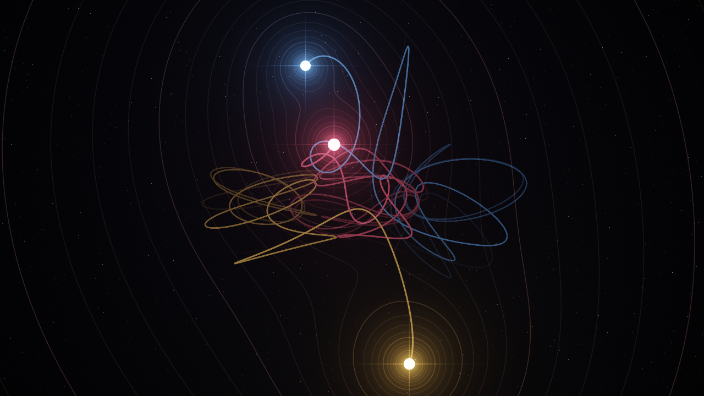

# Three Bodies

**English** | [Português](README.pt-BR.md)

The gravitational three-body problem, live, written in [Bend](https://bend-lang.com). The physics runs on the CPU; every pixel of every frame is computed on the GPU.




## Running it

Install Bend 2 and build the native binary:

```bash
curl -fsSL https://bend-lang.com/install.sh | sh
bend main.bend -o tres && ./tres
```

The build produces `tres` and `tres.gpu`, which must stay in the same folder.

Requirements:

- clang 19 or newer
- macOS: Metal
- Linux: CUDA 12 at `/usr/local/cuda`, and `libx11-dev`

The GPU is used by default. To compare with the CPU:

```bash
./tres --gpu off       # run everything on the CPU, in parallel
./tres --threads 8     # pick the number of CPU threads
```

Tested on an Apple M5 with Bend 2.0.25: 60 FPS at 1280 × 720.

## Controls

| Key | Action |
| --- | --- |
| `1`–`9`, `0` | Pick a scenario |
| `N` / `B` or `→` / `←` | Next / previous |
| `R` | Restart the scenario |
| `Space` | Pause |
| `↑` / `↓` | Speed up / slow down (from 1/8× to 8×) |
| `G` | Toggle the field lines |
| `T` | Toggle the tour |
| `Esc` | Quit |

With the tour on, the next scenario comes in when a body is ejected or when the scenario's time is up.

## Scenarios

| # | Scenario |
| --- | --- |
| 1 | Figure-8 (Moore, Chenciner-Montgomery) |
| 2 | Butterfly I (Šuvakov-Dmitrašinović) |
| 3 | Moth I (Šuvakov-Dmitrašinović) |
| 4 | Yin-Yang I (Šuvakov-Dmitrašinović) |
| 5 | Yarn (Šuvakov-Dmitrašinović) |
| 6 | Lagrange's triangle: from order to chaos |
| 7 | Burrau's Pythagorean problem (masses 3, 4 and 5) |
| 8 | Star, planet and moon |
| 9 | A planet of two stars |
| 0 | Chaos: three random masses |

The first five are periodic solutions. Lagrange's triangle is unstable for equal masses: it holds for a few turns until the rounding of the last bit tears it apart. The last scenario draws three new bodies every time.

The window title and the scenario names inside the app are in Portuguese.

## How it works

### Physics

- Three point masses under Newton's law, with G = 1 and practically no softening (1e-6 of a length unit).
- Positions and velocities in double-single: an `F32` and the rounding error it left behind, summed with Knuth's TwoSum.
- The 4th-order symplectic Forest-Ruth integrator, a composition of three leapfrogs.
- Adaptive step: 2% of the free-fall or fly-by time of the tightest pair, so a gravitational slingshot is resolved instead of skipped.
- The window title shows the drift of the total energy in parts per million.

### Picture

- The whole frame is a single `!` call, which Bend sends to the GPU: eight levels of four-way forks, from a 2048 px root down to 8 px tiles (160 × 90 = 14,400 tiles).
- Each pixel is a closed form of the three bodies: the glare of each one, the equipotential lines of their summed field (tinted by the body that dominates the region), a star field and the trails.
- The trails live in the picture itself: the top byte of each pixel, which the window never shows, holds who passed there and how long ago. The previous frame rides down the fork tree to be read, aged and dropped pixel by pixel.

## Laws and proofs

`LAWS.bend` states four laws about the program and `PROOF.bend` proves them:

- `esc_quits`: Esc quits, whatever the world and whatever follows.
- `close_quits`: closing the window quits.
- `pause_freezes`: a paused world does not move, whatever the clock says.
- `space_twice`: Space twice changes nothing.

To check them:

```bash
bend PROOF.bend --check-only
```

## Files

| File | Contents |
| --- | --- |
| `main.bend` | The simulation: physics, scenarios, pixels, keyboard and main loop |
| `LAWS.bend` | The laws |
| `PROOF.bend` | The proofs |

## License

[MIT](LICENSE) © Adriel Santana
