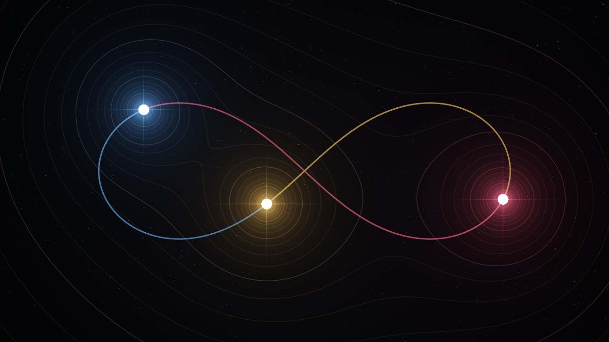

# Três Corpos

[English](README.md) | **Português**

O problema gravitacional dos três corpos, ao vivo, escrito em [Bend](https://bend-lang.com). A física roda na CPU; cada pixel de cada quadro é calculado na GPU.




## Como rodar

Instale o Bend (2.0.34 ou mais novo) e compile o binário nativo:

```bash
curl -fsSL https://bend-lang.com/install.sh | sh
bend main.bend -o tres && ./tres
```

A compilação gera `tres` e `tres.gpu`, que precisam ficar na mesma pasta.

Requisitos:

- clang 19 ou mais novo
- macOS: Metal
- Linux: CUDA 12 em `/usr/local/cuda` e `libx11-dev`

A GPU é usada por padrão. Para comparar com a CPU:

```bash
./tres --gpu off       # roda tudo na CPU, em paralelo
./tres --threads 8     # escolhe o número de threads da CPU
```

Testado em um Apple M5 com Bend 2.0.34: 60 FPS em 1280 × 720.

## Controles

| Tecla | Ação |
| --- | --- |
| `1`–`9`, `0` | Escolhe o cenário |
| `N` / `B` ou `→` / `←` | Próximo / anterior |
| `R` | Reinicia o cenário |
| `Espaço` | Pausa |
| `↑` / `↓` | Acelera / desacelera (de 1/8× a 8×) |
| `G` | Liga ou desliga as linhas de campo |
| `T` | Liga ou desliga o tour |
| `Esc` | Sai |

Com o tour ligado, o próximo cenário entra quando um corpo é ejetado ou quando o tempo do cenário acaba.

## Cenários

| # | Cenário |
| --- | --- |
| 1 | Figura-8 (Moore, Chenciner-Montgomery) |
| 2 | Borboleta I (Šuvakov-Dmitrašinović) |
| 3 | Mariposa I (Šuvakov-Dmitrašinović) |
| 4 | Yin-Yang I (Šuvakov-Dmitrašinović) |
| 5 | Novelo (Šuvakov-Dmitrašinović) |
| 6 | Triângulo de Lagrange: da ordem ao caos |
| 7 | Problema pitagórico de Burrau (massas 3, 4 e 5) |
| 8 | Estrela, planeta e lua |
| 9 | Planeta de duas estrelas |
| 0 | Caos: três massas ao acaso |

Os cinco primeiros são soluções periódicas. O triângulo de Lagrange é instável para massas iguais: aguenta algumas voltas até o arredondamento do último bit desfazê-lo. O último cenário sorteia três corpos novos a cada vez.

O título da janela e os nomes dos cenários dentro do app estão em inglês.

## Como funciona

### Física

- Três massas pontuais sob a lei de Newton, com G = 1 e praticamente sem suavização (1e-6 de uma unidade de comprimento).
- Todos os números da física são *doubles* IEEE-754 calculados em software, pelo `f64.bend` do [Giulio2002/bend-collections](https://github.com/Giulio2002/bend-collections) (veja [Créditos](#créditos)). Como esses *doubles* são código Bend comum, o verificador de provas também consegue calculá-los, e é isso que torna o `PHYSICS.bend` possível.
- A física nunca divide nem tira raiz quadrada: `1/√x` sai de quatro passos de Newton a partir de um palpite inicial lido dos bits.
- Integrador simplético de 4ª ordem de Forest-Ruth, uma composição de três leapfrogs.
- Passo adaptativo: 2% do tempo de queda livre ou de passagem do par mais próximo, para resolver um estilingue gravitacional em vez de pular por cima dele.
- O título da janela mostra a deriva da energia total em partes por milhão.

### Imagem

- O quadro inteiro é uma única chamada `!`, que o Bend manda para a GPU: oito níveis de bifurcações em quatro, de uma raiz de 2048 px até ladrilhos de 8 px (160 × 90 = 14 400 ladrilhos).
- Cada pixel é uma forma fechada dos três corpos: o brilho de cada um, as linhas equipotenciais do campo somado (tingidas pelo corpo que domina a região), um campo de estrelas e os rastros.
- Os rastros moram na própria imagem: o byte mais alto de cada pixel, que a janela nunca mostra, guarda quem passou por ali e há quanto tempo. O quadro anterior desce pela árvore de bifurcações para ser lido, envelhecido e descartado pixel a pixel.

## Leis e provas

`LAWS.bend` diz o que o programa tem que fazer, e `PROOF.bend` prova. O verificador do Bend confere cada lei para todas as entradas possíveis, e não para uma amostra, como um teste faria. A verificação leva cerca de um minuto:

```bash
bend PROOF.bend --check-only
```

### Do one-shot

| Lei | O que garante |
| --- | --- |
| `esc_quits` | Esc encerra, qualquer que seja o mundo e o que vier depois. |
| `close_quits` | Fechar a janela encerra. |
| `pause_freezes` | Um quadro pausado não move os corpos, diga o relógio o que disser. |
| `space_twice` | Espaço duas vezes não muda nada. |

### Adicionadas depois, pelo Claude Opus 5.5

| Lei | O que garante |
| --- | --- |
| `step_keeps_mass` | Um passo do integrador nunca muda uma massa, quaisquer que sejam os corpos e o tamanho do passo. |
| `run_keeps_mass` | Nem uma simulação inteira, com quantos passos for (por indução). |
| `starts_at_rest` | Cada um dos nove cenários fixos começa com o centro de massa na origem e momento zero, até 1e-15. |
| `esc_anywhere` | Esc encerra em qualquer ponto dos eventos de um quadro, não importa o que veio antes. |
| `close_anywhere` | Fechar a janela também. |
| `digits_pick` | As teclas 1–9 escolhem os cenários 1–9, e o 0 escolhe o 10º, a partir de qualquer estado. |
| `n_cycles` | A partir do primeiro cenário, N passa pelos outros nove em ordem e volta ao primeiro. |
| `b_cycles` | B faz o mesmo de trás para frente. |
| `restart_restores` | Em qualquer um dos nove cenários fixos, R devolve os corpos exatamente ao início do cenário, não importa o que aconteceu antes. |
| `pause_keeps_run` | Um quadro pausado mantém o cenário, o tempo simulado e o relógio do tour. |
| `pause_keeps_trails` | Um quadro desenhado em pausa não apaga rastro nenhum. |
| `load_wipes` | Um cenário novo apaga os rastros antigos, uma única vez. |
| `g_twice` | G duas vezes não muda nada. |
| `t_twice` | T duas vezes não muda nada. |

Cada lei nova também foi testada contra bugs injetados de propósito, como deixar o integrador mexer numa massa, fazer o N pular um cenário ou fazer o R ir para o próximo. Todos os bugs fizeram a verificação falhar.

A física também foi trocada depois, de `F32` para *doubles* em software. O verificador do Bend trata as contas com `F32` como caixas-pretas (não consegue provar nem `1.5 + 2.25 == 3.75` em `F32`), então com `F32` nada sobre as órbitas podia ser provado.

### A física: `PHYSICS.bend`

O `PHYSICS.bend` prova um teorema sobre o próprio integrador do app, começando de onde o app começa a figura-8 e rodando por um terço do período (352 passos). Ele afirma quatro coisas:

1. O integrador percorre todo esse tempo dentro do seu limite de passos.
2. Cada corpo termina onde o seguinte começou, com a velocidade com que ele começou, com erro menor que 1e-7. Os três corpos se perseguem ao longo de uma única curva: essa é a propriedade que define a figura-8, e só a lei de Newton a produz.
3. A energia total fica a menos de uma parte em 10⁹ do valor inicial.
4. O momento total, zero no início, fica abaixo de 1e-13.

A prova não usa táticas nem aproximações: o próprio verificador roda os 352 passos, com os mesmos *doubles* em software que o app usa, e lê as quatro respostas. Isso leva cerca de três horas:

```bash
bend PHYSICS.bend --check-only
```

**Status:** a primeira verificação completa começou em 2 de outubro de 2026 e ainda está rodando. Esta seção vai ser atualizada com o resultado.

### O que não está provado

- **Outras condições iniciais.** O teorema é sobre a figura-8 e esse intervalo de tempo. Uma lei para quaisquer condições iniciais ("para quaisquer corpos, a energia varia menos que X") exigiria uma análise formal dos erros de arredondamento, o que ainda está fora de alcance aqui.
- **Os quadros que o app mostra.** O app roda o mesmo integrador, mas em pedaços de um quadro cada; o teorema roda tudo de uma vez.
- **A imagem e o sistema operacional.** A imagem calculada na GPU continua em `F32` e não tem provas. O código de janela e teclado que conversa com o sistema operacional está fora do alcance das provas do Bend.

## Arquivos

| Arquivo | Conteúdo |
| --- | --- |
| `main.bend` | A simulação: física, cenários, pixels, teclado e laço principal |
| `LAWS.bend` | As leis: o que o programa tem que fazer |
| `PROOF.bend` | As provas |
| `PHYSICS.bend` | O teorema da figura-8, com a prova |
| `vendor/bend-collections/` | Os *doubles* em software, do Giulio2002/bend-collections |

## Créditos

Os *doubles* em software de `vendor/bend-collections/` são do [Giulio2002](https://github.com/Giulio2002), do projeto [bend-collections](https://github.com/Giulio2002/bend-collections) (MIT). O binary64 IEEE-754 dele, escrito em Bend puro e provado com arredondamento correto, é o que permite ao verificador calcular a física, e portanto o que torna o `PHYSICS.bend` possível.

## Licença

[MIT](LICENSE) © Adriel Santana
